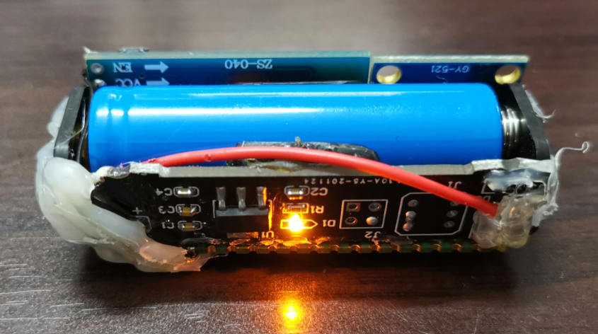

# 姿态传感器检测跌倒
1. 阐述国内外现状，包括测量方法和测量仪器，分析各自的优缺点；
2. 提出或选择一种测量方法，设计测量仪器或系统方案（结构示意图），对传感器等主要功能部件进行详细说明；
3. 阐述测量原理（原理图），推导数学模型；
4. 分析测量仪器或系统的分辨力和测量误差，评定目标测量不确定度。
5. 每人选择1个问题，题目自拟，设计内容必须独立完成。以PPT报告和纸质设计报告（论文）形式提交，并在讨论课上“答辩”（每人15分钟以内，汇报10分钟，讨论5分钟）。
6. 每个题目最多3个人选，多人选择一个题目，方案可以相同也可以不同，但是介绍时必须分析自己与他人方案相比的优缺点。
[TOC]
# 背景

近年来，老年人因跌倒所致健康问题成了社会关注的重点。据调查，2003—2018年，65～74岁年龄段的老年人因跌倒而导致死亡的上升趋势明显，75岁及以上年龄段老年人跌倒死亡率最高。因此，对老年人进行跌倒监测和预防，不仅可以避免因跌倒导致的一系列严重后果，还可以为家庭减轻精神和经济负担，具有比较重要的现实意义.

## 现状
目前主流针对跌倒检测的方法有2种：
- 图像分析法
  - 优点:应用广泛
  - 缺点:计算量较大，算力成本高, 设备安装成本高
- 姿态传感器
  - 优点:计算量小、不受环境限制、成本低, 可移动, 无遮挡
- 基于环境嵌入声学、压力或红外线传感器的跌倒监测方法
  - 虽然成本较低，不涉及用户隐私
  - 受到室外环境限制
- 表面肌电图和足底压力信号
  - 解决了可穿戴设备的诸多不便
  - 只能分辨行走和跌倒，应用场景单一，限定了只能穿特定鞋垫的鞋

本系统是一种腰带姿态传感器，利用一阶互补滤波算法从mpu6050传感器得到俯仰角与横滚角，经多级阈值算法判断人体的行为姿态。这样采集到的人体跌倒数据比较全面、准确，最终的跌倒判断就会更可靠、稳健。

# 系统方案
## 组成
本系统由供电部分, 主控部分, 姿态传感器与通信部份组成

## 供电部分
电池为一节14500锂电池, 容量1300mAh, 额定电压3.7V. 该电池连接一个AMS1117降压电路, 得到稳定的3V3输出, 为后续系统供电.

## 树莓派pico
树莓派Pico是树莓派基金会自主研发的一款双核MCU:RP2040，提供了超低功耗、极低的I/O延迟，可用micro-python或C语言编写程序。

RP2040 芯片是 7×7mm QFN-56 封装的，具体规格参数如下：
- 双核 Arm Cortex-M0 + @ 133MHz
- 芯片内置 264KB SRAM 和 2MB 的板载闪存
- 通过专用 QSPI 总线支持最高 16MB 的片外闪存
- DMA 控制器
- 30 个 GPIO 引脚，其中 4 个可用作模拟输入
- 2 个 UART、2 个 SPI 控制器和 2 个 I2C 控制器
- 16 个 PWM 通道
- USB 1.1 主机和设备支持
- 8 个树莓派可编程 I/O（PIO）状态机，用于自定义外围设备支持
- 支持 UF2 的 USB 大容量存储启动模式，用于拖放式编程

## 蓝牙HC05模块
HC05模块是ALIENTEK一款高性能主从一体蓝牙串口模块，支持非常宽的波特率范围：4800~1382400, 可以同各种带蓝牙功能的电脑、蓝牙主机、手机、PDA、PSP等智能终端配对

## 姿态传感器mpu6050

InvenSense公司推出的全球首款整合性6轴运动处理组件,输出三轴加速度ax,ay,az和三轴角速度gx,gy,gz,体积4x4x9mm,i2c通信,量程范围角速度±250，±500，±1000，±2000°/sec(dps),加速度±2g，±4g，±8g，±16g

## 一阶互补滤波

加速度机对加速度很敏感,用来计算倾角误差较大,陀螺仪的角速度比较准确,但积分漂移和温度漂移误差较大,两个传感器可以弥补相互缺点,单纯以六轴传感器不能得到准确的Yaw角,但在跌倒场景中,Yaw角并不是特别重要.

比如对于pitch角(绕y轴旋转角),由加速度计计算得到的绕y轴角度(x轴转过的角度)$angleAy=\frac{ax}{\sqrt{ay^2+az^2}}$,由陀螺仪计算得到的绕y轴角度$angleGy=last_pitch+gy*dt$

定义k代表加速度计的权重,1-k即陀螺仪的权重,最终得到$pitch=k\times angleAy+(1-k)\times angleGy$

此外还有其他方法可以得到三轴姿态角:
- 四元数
- 卡尔曼滤波
- 数字运动处理器DMP

# 测量原理

## 跌倒检测

跌倒判断就是要区分跌倒行为和日常活动,标记异常活动并报警;对老年人,跌倒会导致比较严重的后果,检测原则是允许出现误报,但不允许出现漏报,所以需要一组合适的阈值进行判断;其次是可穿戴设备要适应老年人的生活习惯,尽量简化装备和操作流程.

- 跌倒原因
  - 行为因素:药物,醉酒,疲劳
  - 生理因素:骨质酥松,肌肉无力,昏厥,低血糖,高血压
  - 物理环境:地滑,照明,障碍物,楼梯,台阶,路面不平,雨雪,交通工具
- 跌倒种类
  - 向前扑倒,向后跌倒,向侧方跌倒

几种跌倒情况的共同特征是躯干的俯仰角或横滚角在短时间内剧烈变化,同样由于失重和与地面撞击,加速度也会剧烈变化,日常生活中,为了排除各项日常活动带来的干扰,需要将角速度和加速度综合考虑.

所以,出于便携性,实用性和准确性考虑,姿态传感器最佳安放位置为腰部,可以设计为腰带形式,在穿戴状态下启动.在躺下入睡或坐下时可以选择解除腰带.

## 跌倒分析
跌倒过程一般分为四个阶段:
- 直立静止或行走状态:人体z轴加速度为一倍重力加速度,pr角和加速度有轻微变化
- 跌倒阶段:人体位于失重状态,z轴加速度变小
- 撞击阶段:撞击到地面瞬间,加速度值方向改变到达一个峰值后回落,方向再次改变到达另一个峰值,并再次回落
- 静止阶段:可能躺倒在地面或者仰坐,侧坐

## 量化分析
- 加速度幅度值$SVM=\sqrt{a_x^2+a_y^2+a_z^2}$
- z轴倾角$\omega=\sqrt{\omega_p^2+\omega_r^2}$
- 离散程度$V=\frac{\frac{1}{n}\sum_{i=1}^nX_i}{\sqrt{\frac{1}{n}\sum_{i=1}^n(X_i-\bar{X})^2}}$

一般情况下跌倒会在1~2秒内发生,所以在数秒以内,SVM值会出现数个明显峰值,$\omega$也会有较大变化,同时这两个值得离散程度也会有较大变化,对这三个值设定阈值,可以比较准确地对跌倒进行监测.

## 干扰分析
- 考虑到跌倒后可能存在坐起的情况,z轴倾角的权重可以设置小一些,而把反映倾角变化的离散程度的权重设置得大一些.
- 对于午睡或躺在座椅上的情景,z轴倾角的变化情况也与跌倒有一定重合,但通常在睡眠场合,腰带等会被摘下,所以可以暂时忽略
- 突然坐下时,SVM数值变化也与跌倒相似,都有失重,撞击,反弹,静止的过程,但这种场合下z轴变化不明显

# 不确定度

## 分辨力
在初始化mpu6050时, 陀螺仪可选量程$\pm250^\circ/\sec, \pm500^\circ/\sec, \pm1000^\circ/\sec, \pm2000^\circ/\sec$, 加速度计可选量程$\pm2g, \pm4g, \pm8g, \pm16g$
## 测量误差

## 不确定度

# 方案比较
视觉方案
- 优点
  - 老人一般记性较差,视觉方案不需要老人进行操作
  - 可以同时检测一个场景内多个老人
- 缺点
  - 部署成本高,每一个房间都需要一个以上摄像头
  - 对于室内场景,家具,房间等较多,很容易出现遮挡情况
  - 存在隐私问题
  - 计算量大,要考虑供电和视频信号处理,耗电量也大
姿态传感器方案
- 优点
  - 不受时空局限,在室内室外均可检测
  - 计算量小,成本低
- 缺点
  - 需要培养穿戴习惯
  - 要注意电池更换

# 参考
[MPU6050 抄底解读](https://mp.weixin.qq.com/s?__biz=MzU2OTk0Njc0Mw==&mid=2247484849&idx=1&sn=4f06ef412da5409e4668b514b5cf684d&scene=21#wechat_redirect)
[MPU6050 姿态解算系列一：加速度姿态解算](https://mp.weixin.qq.com/s/3H0Z_8wCPAemRcwDW1vMwg)
[MPU6050 姿态解算系列二：陀螺仪姿态解算](https://mp.weixin.qq.com/s/PDHciPY1hWOWNKqvqQK3Ow)
[MPU6050 姿态解算系列三：互补滤波](https://mp.weixin.qq.com/s/KaM-zSasyzMnckBHgctX7Q)
[MPU6050 姿态解算系列四：线性 Kalman 滤波](https://mp.weixin.qq.com/s/nks1CrE9EnZV7UrN1FB4HQ)